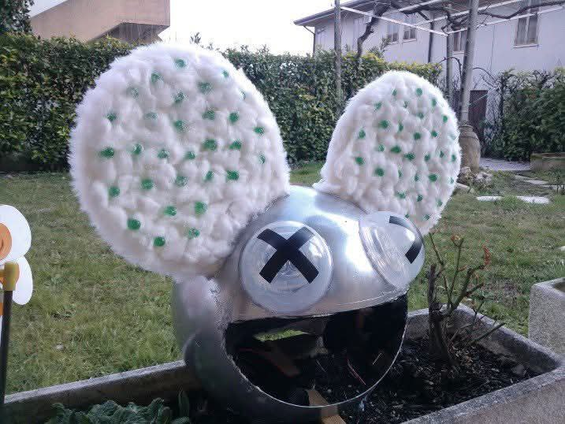

# vu-meter
A simple project VU-Meter with LED using LM358 and LM3914 using KiCad 9.0

This project is a personal project of mine from many years ago. 

It's a simple 9V circuit capable of lighting up LEDs in sequence based on sound. 

It's customizable, and I used it to build a mask for Carnival.  

  
  
  
  
[See this video](https://www.youtube.com/watch?v=xuSfuvD5daY)

[and this video](https://youtu.be/nWELFq1WQ_s)

  

  